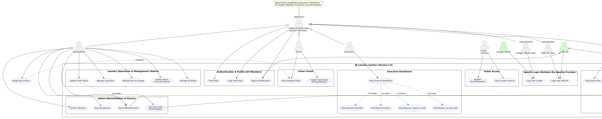
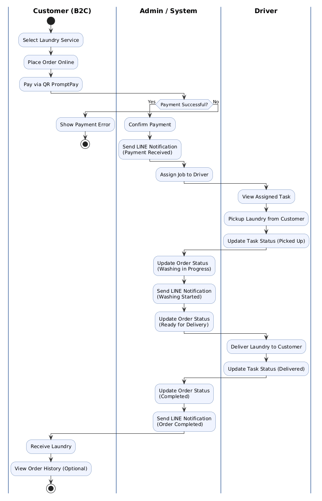
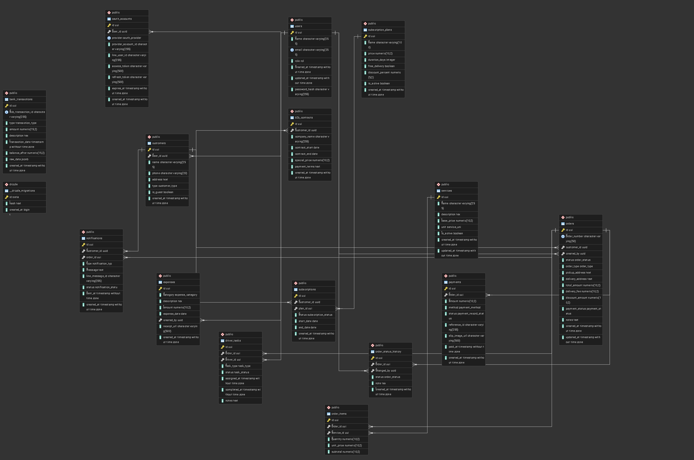
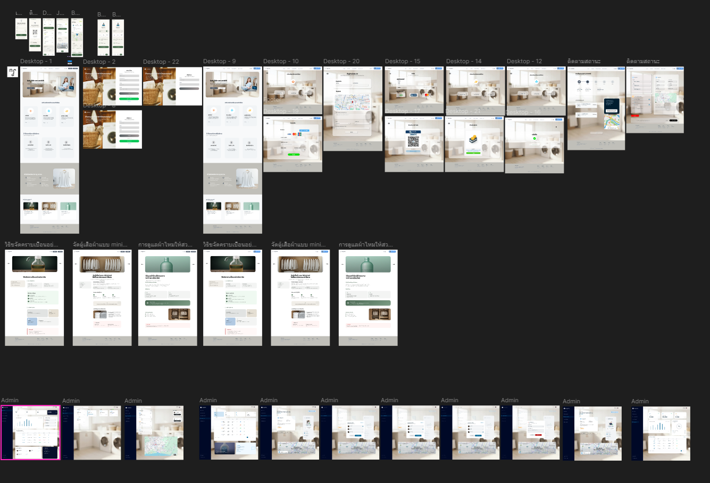

# nongJames Laundry Shop

## 1. บทนำ
nongJames Laundry Shop เป็นระบบจัดการบริการซัก-อบ-รีด สำหรับลูกค้าและร้านค้า มีโมดูลจัดการคำสั่งซื้อ การชำระเงิน การแจ้งเตือน และการจัดส่ง

## 2. รายละเอียดโครงงาน
### 2.1 ทีมงาน และบทบาท
- Product Owner: อรัญชัย คำเพ็ญ
- UX/UI Designer: นายสรวิชญ์ สมตน,นายวันชนะ ไชยลังกา,นายอนาวิล บุญช่วย
- Frontend Developer: นายอนาวิล บุญช่วย
- Backend Developer: นายวรปรัชญ์ บุญมี,นายอรัญชัย คำเพ็ญ
- QA/Test Engineer: นางสาวชญานิศ ธีรเวโรจน์
### 2.2 SRS และการพัฒนา
- SRS อยู่ใน `documents/PM.XX/PM.00/SRS-laundry-shop/SRS-001.md`, `SRS-002.md`, `SRSoriginal.md`
- วางสเปค requirement ฟังก์ชันการทำงาน, ข้อมูล, user flow, non-functional requirements

### 2.3 ผลการออกแบบ
1. System Architecture
   - รายการ: Frontend: VUE + Backend: Node.js + Database: SQLite
   - บริการรองรับ: auth, customers, orders, payments, logistics, finance, notifications, services
2. Use Case Diagram
   
3. Activity Diagram
   
4. ER Diagram 
   
5. UX/UI
   
`

### 2.4 Tech Stack
- Frontend: VUE
- Backend: Node.js
- Database: SQLite
### 2.5 Test Case และ API Testing
- Test case example:
  - สร้าง account ใหม่, login, สร้าง order, จ่ายเงิน, อัปเดตสถานะ
  - กรณีทดสอบ edge: ค่าบริการไม่พอ, token หมดอายุ
- API Testing:
  - `POST /auth/login`, `GET /orders`, `POST /orders`, `POST /payments`

## 3. ลิงก์โฟลเดอร์สำคัญ
- `laundry-management-system` (Folder project)
- `documents/PM.XX` (เอกสาร PM/SRS)

